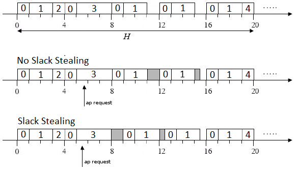

# Real-Time-Clockdriven
***
Development of a clock-driven scheduling library that allows to execute a set of periodic tasks and an aperiodic task. have been used priority, affinity, multithreading and deadline control. The application works on a single processor core (affinity 1). 
The scheduling in the image was previously done using a static scheduling algorithm that provides the system with a feasible schedule, if exists.

The tasks τ0, τ1, τ2, τ3, τ4  are given:
- τ0 = (4, 1, 4)
- τ1 = (5,2,7)
- τ2 = (20,1, 20)
- τ3 = (20.3.20)
- τ4 = (20.1.20).

The information necessary for the executive to manage the activation of the tasks is as follows: 
- H = 20;
- m = 4;
- F0 = {τ0, τ1, τ2} 
- F1 = {τ0, τ3}
- F2 = {τ0, τ1}
- F3 = {τ0, τ1}
- F4 = {τ0, τ1, τ4}.

Reference scheduling for this example: 

## Application launch
You need to compile the file with the make command.  
for a correct priority setting all executables must be run with sudo.  

* Launching <b>sudo ./application-ok</b> will be show an optimal situation where there should be no deadline miss and the tasks will be optimally scheduled. 

* Launching <b>sudo ./application-err_p</b> will be shown a deadline miss situation in periodic tasks, in this case a task is running too busy waiting compromising the execution of some periodic task in the frame and causing deadline misses. 

* Launching <b>sudo ./application-err_a</b> will be shown a deadline miss situation in the aperiodic task, the aperiodic task is called every so often during the execution of a periodic task. If a release of the periodic is requested without terminating the previous execution, there is a deadline miss of the aperiodic task. 

By uncommenting the <b>#define SLACK_STEALING_ON</b> line in executive.cpp, you can choose to use slack stealing. It serves to minimize the average response time of the aperiodic task.
 

Depending on the machine on which it is launched, it is possible from time to time to have some deadline misses also in application-ok, especially in laptops without mains power. This is due to power saving settings that lower the CPU clock. A trick to mitigate this problem is to launch a terminal with the following command: 

------------------------------------
$ yes > /dev/null

------------------------------------
This will create an infinite loop that will force the processor to raise its clock. 
